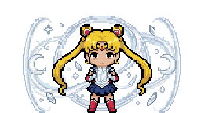
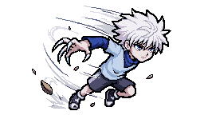
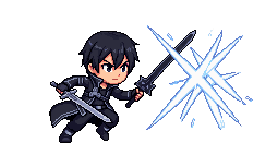
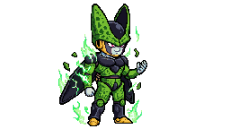
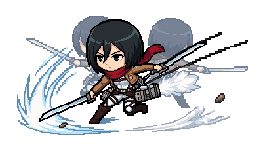

# Agenda de Personagens

Gerado em 11/09/2026 08:26 (Brasília). Post diário às 19:00.
Pra tirar alguém da fila, edite `data/pular.txt` (um slug por linha) e o calendário se refaz.

Fora da fila agora: chopper, lelouch, shinji, spike, uraraka.

| Data | Arte | Carta | Anime (fundo: mundo do PvE) | Raridade |
|---|---|---|---|---|
| 11/09 (sex) |  | **Alphonse** `alphonse` | Fullmetal Alchemist (Portal da Verdade) | Épico |
| 12/09 (sáb) |  | **Sakura** `sakura` | Naruto (Vila Oculta da Folha) | Raro |
| 13/09 (dom) |  | **Hisoka** `hisoka` | Hunter x Hunter (Portão da Mansão Sombria) | Épico |
| 14/09 (seg) |  | **Genos** `genos` | One-Punch Man (Cidade em Ruínas) | Épico |
| 15/09 (ter) |  | **Itachi** `itachi` | Naruto (Vila Oculta da Folha) | Lendário |
| 16/09 (qua) |  | **Rukia** `rukia` | Bleach (Deserto de Hueco Mundo) | Raro |
| 17/09 (qui) |  | **Subaru** `subaru` | Re:Zero (Planície da Névoa) | Raro |
| 18/09 (sex) |  | **Albedo** `albedo` | Overlord (Grande Tumba de Mármore) | Épico |
| 19/09 (sáb) |  | **Zeke** `zeke` | Attack on Titan (Distrito da Muralha) | Épico |
| 20/09 (dom) |  | **Umaru** `umaru` | Umaru-chan (Quarto do Kotatsu) | Incomum |
| 21/09 (seg) |  | **Annie** `annie` | Attack on Titan (Distrito da Muralha) | Raro |
| 22/09 (ter) |  | **Kenshiro** `kenshiro` | Hokuto no Ken (Deserto Sem Lei) | Lendário |
| 23/09 (qua) |  | **Madara** `madara` | Naruto (Vila Oculta da Folha) | Lendário |
| 24/09 (qui) |  | **Reze** `reze` | Chainsaw Man (Viela dos Demônios) | Raro |
| 25/09 (sex) |  | **Kenshin** `kenshin` | Samurai X (Pátio do Dojo) | Épico |
| 26/09 (sáb) |  | **Ichigo** `ichigo` | Bleach (Deserto de Hueco Mundo) | Lendário |
| 27/09 (dom) |  | **Frieren** `frieren` | Frieren (Vila do Grande Herói) | Lendário |
| 28/09 (seg) |  | **Naruto** `naruto` | Naruto (Vila Oculta da Folha) | Lendário |
| 29/09 (ter) |  | **Shinobu** `shinobu` | Demon Slayer (Montanha Nevada) | Épico |
| 30/09 (qua) |  | **Gohan** `gohan` | Dragon Ball (Ermos do Torneio) | Épico |
| 01/10 (qui) |  | **Giyu** `giyu` | Demon Slayer (Montanha Nevada) | Épico |
| 02/10 (sex) |  | **Zoro** `zoro` | One Piece (Porto dos Piratas) | Épico |
| 03/10 (sáb) |  | **Rem** `rem` | Re:Zero (Planície da Névoa) | Épico |
| 04/10 (dom) |  | **Endeavor** `endeavor` | My Hero Academia (Domo de Desastres) | Épico |
| 05/10 (seg) |  | **Jiraiya** `jiraiya` | Naruto (Vila Oculta da Folha) | Épico |
| 06/10 (ter) |  | **Shanks** `shanks` | One Piece (Porto dos Piratas) | Lendário |
| 07/10 (qua) |  | **Loid** `loid` | Spy x Family (Academia de Elite) | Épico |
| 08/10 (qui) |  | **Usopp** `usopp` | One Piece (Porto dos Piratas) | Incomum |
| 09/10 (sex) |  | **Inosuke** `inosuke` | Demon Slayer (Montanha Nevada) | Raro |
| 10/10 (sáb) |  | **Pain** `pain` | Naruto (Vila Oculta da Folha) | Lendário |
| 11/10 (dom) |  | **Trunks** `trunks` | Dragon Ball (Ermos do Torneio) | Épico |
| 12/10 (seg) |  | **Mustang** `mustang` | Fullmetal Alchemist (Portal da Verdade) | Épico |
| 13/10 (ter) |  | **Escanor** `escanor` | Seven Deadly Sins (Colina da Taverna) | Lendário |
| 14/10 (qua) |  | **Light** `light` | Death Note (Telhados do Crepúsculo) | Lendário |
| 15/10 (qui) |  | **Tatsumaki** `tatsumaki` | One-Punch Man (Cidade em Ruínas) | Lendário |
| 16/10 (sex) |  | **Todoroki** `todoroki` | My Hero Academia (Domo de Desastres) | Épico |
| 17/10 (sáb) |  | **Mahito** `mahito` | Jujutsu Kaisen (Cruzamento Assombrado) | Épico |
| 18/10 (dom) |  | **Robin** `robin` | One Piece (Porto dos Piratas) | Raro |
| 19/10 (seg) |  | **Serena** `sailormoon` | Sailor Moon (Torre sob a Lua Cheia) | Épico |
| 20/10 (ter) |  | **Killua** `killua` | Hunter x Hunter (Portão da Mansão Sombria) | Épico |
| 21/10 (qua) |  | **Kirito** `kirito` | Sword Art Online (Castelo Flutuante) | Épico |
| 22/10 (qui) |  | **Cell** `cell` | Dragon Ball (Ermos do Torneio) | Lendário |
| 23/10 (sex) |  | **Mikasa** `mikasa` | Attack on Titan (Distrito da Muralha) | Épico |
| 24/10 (sáb) |  | **Asuna** `asuna` | Sword Art Online (Castelo Flutuante) | Lendário |
| 25/10 (dom) |  | **Aki** `aki` | Chainsaw Man (Viela dos Demônios) | Raro |
