# Agenda de Personagens

Gerado em 07/10/2026 22:23 (Brasília). Post diário às 19:00.
Pra tirar alguém da fila, edite `data/pular.txt` (um slug por linha) e o calendário se refaz.

Fora da fila agora: chopper, lelouch, shinji, spike, uraraka.

| Data | Arte | Carta | Anime (fundo: mundo do PvE) |
|---|---|---|---|
| 07/10 (qua) |  | **Loid** `loid` | Spy x Family (Academia de Elite) |
| 08/10 (qui) | 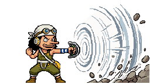 | **Usopp** `usopp` | One Piece (Porto dos Piratas) |
| 09/10 (sex) | 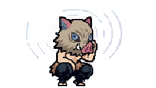 | **Inosuke** `inosuke` | Demon Slayer (Montanha Nevada) |
| 10/10 (sáb) | 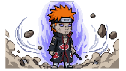 | **Pain** `pain` | Naruto (Vila Oculta da Folha) |
| 11/10 (dom) | 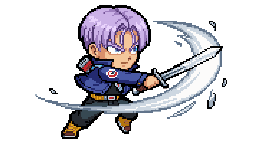 | **Trunks** `trunks` | Dragon Ball (Ermos do Torneio) |
| 12/10 (seg) | 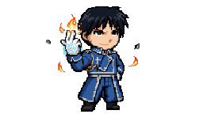 | **Mustang** `mustang` | Fullmetal Alchemist (Portal da Verdade) |
| 13/10 (ter) | 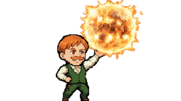 | **Escanor** `escanor` | Seven Deadly Sins (Colina da Taverna) |
| 14/10 (qua) | 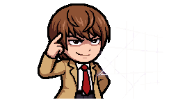 | **Light** `light` | Death Note (Telhados do Crepúsculo) |
| 15/10 (qui) | 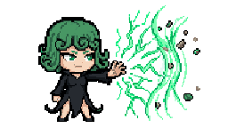 | **Tatsumaki** `tatsumaki` | One-Punch Man (Cidade em Ruínas) |
| 16/10 (sex) | 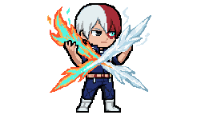 | **Todoroki** `todoroki` | My Hero Academia (Domo de Desastres) |
| 17/10 (sáb) | 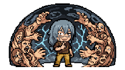 | **Mahito** `mahito` | Jujutsu Kaisen (Cruzamento Assombrado) |
| 18/10 (dom) | 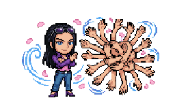 | **Robin** `robin` | One Piece (Porto dos Piratas) |
| 19/10 (seg) |  | **Serena** `sailormoon` | Sailor Moon (Torre sob a Lua Cheia) |
| 20/10 (ter) | 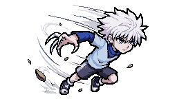 | **Killua** `killua` | Hunter x Hunter (Portão da Mansão Sombria) |
| 21/10 (qua) | 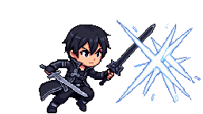 | **Kirito** `kirito` | Sword Art Online (Castelo Flutuante) |
| 22/10 (qui) | 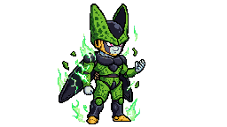 | **Cell** `cell` | Dragon Ball (Ermos do Torneio) |
| 23/10 (sex) | 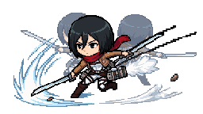 | **Mikasa** `mikasa` | Attack on Titan (Distrito da Muralha) |
| 24/10 (sáb) |  | **Asuna** `asuna` | Sword Art Online (Castelo Flutuante) |
| 25/10 (dom) |  | **Aki** `aki` | Chainsaw Man (Viela dos Demônios) |
| 26/10 (seg) | 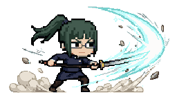 | **Maki** `maki` | Jujutsu Kaisen (Cruzamento Assombrado) |
| 27/10 (ter) | 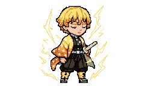 | **Zenitsu** `zenitsu` | Demon Slayer (Montanha Nevada) |
| 28/10 (qua) | 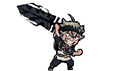 | **Asta** `asta` | Black Clover (Ossada do Demônio Ancestral) |
| 29/10 (qui) | 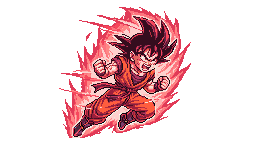 | **Goku** `goku` | Dragon Ball (Ermos do Torneio) |
| 30/10 (sex) | 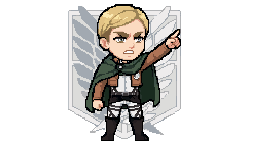 | **Erwin** `erwin` | Attack on Titan (Distrito da Muralha) |
| 31/10 (sáb) | 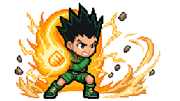 | **Gon** `gon` | Hunter x Hunter (Portão da Mansão Sombria) |
| 01/11 (dom) | 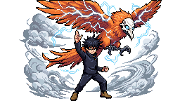 | **Megumi** `megumi` | Jujutsu Kaisen (Cruzamento Assombrado) |
| 02/11 (seg) | 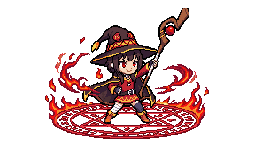 | **Megumin** `megumin` | Konosuba (Praça dos Aventureiros) |
| 03/11 (ter) | 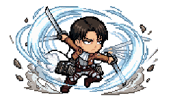 | **Levi** `levi` | Attack on Titan (Distrito da Muralha) |
| 04/11 (qua) | 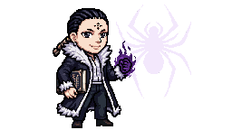 | **Chrollo** `chrollo` | Hunter x Hunter (Portão da Mansão Sombria) |
| 05/11 (qui) | 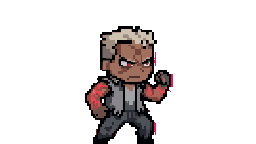 | **Scar** `scar` | Fullmetal Alchemist (Portal da Verdade) |
| 06/11 (sex) |  | **Leorio** `leorio` | Hunter x Hunter (Portão da Mansão Sombria) |
| 07/11 (sáb) | 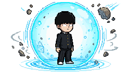 | **Mob** `mob` | Mob Psycho 100 (Parque do Brócolis Colossal) |
| 08/11 (dom) | 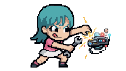 | **Bulma** `bulma` | Dragon Ball (Ermos do Torneio) |
| 09/11 (seg) | 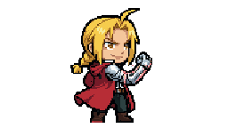 | **Edward** `edward` | Fullmetal Alchemist (Portal da Verdade) |
| 10/11 (ter) | 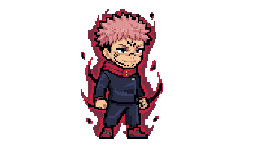 | **Yuji** `yuji` | Jujutsu Kaisen (Cruzamento Assombrado) |
| 11/11 (qua) |  | **Hange** `hange` | Attack on Titan (Distrito da Muralha) |
| 12/11 (qui) | 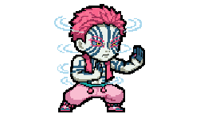 | **Akaza** `akaza` | Demon Slayer (Montanha Nevada) |
| 13/11 (sex) | 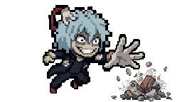 | **Shigaraki** `shigaraki` | My Hero Academia (Domo de Desastres) |
| 14/11 (sáb) |  | **Saori** `saori` | Saint Seiya (Santuário dos Doze Templos) |
| 15/11 (dom) |  | **Anya** `anya` | Spy x Family (Academia de Elite) |
| 16/11 (seg) | 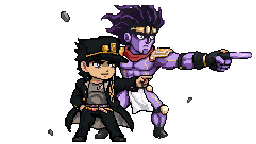 | **Jotaro** `jotaro` | JoJo (Telhados do Cairo) |
| 17/11 (ter) | 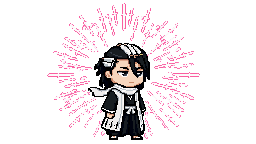 | **Byakuya** `byakuya` | Bleach (Deserto de Hueco Mundo) |
| 18/11 (qua) | 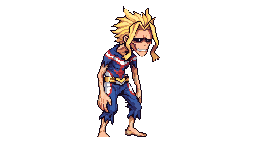 | **All Might** `allmight` | My Hero Academia (Domo de Desastres) |
| 19/11 (qui) | 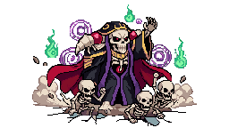 | **Ainz** `ainz` | Overlord (Grande Tumba de Mármore) |
| 20/11 (sex) | 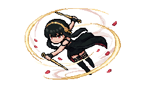 | **Yor** `yor` | Spy x Family (Academia de Elite) |
